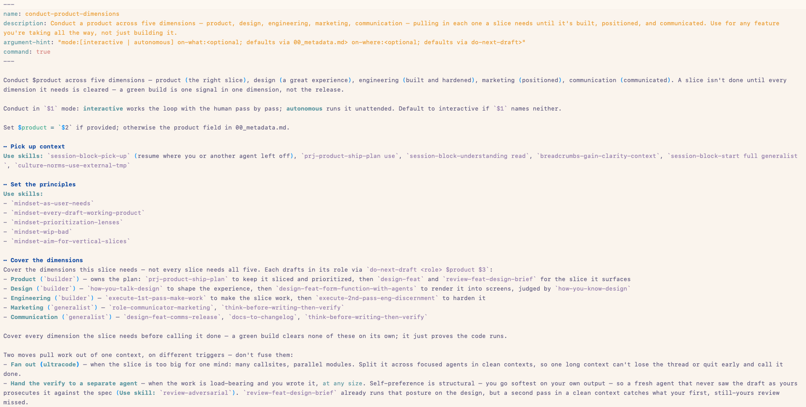
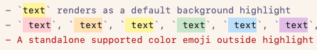

This directory holds this flavour's docs, scripts, and version metadata.
See [MAINTENANCE.md](MAINTENANCE.md) for maintenance and upstream-sync guidance.
Use `script/install-local` to install the current build, and `zed-rbf/scripts/weekly-build.sh` to rebuild it weekly.

# 🔵⋯ Use
This is for my personal use and shared publicly for those curious.
I'm not accepting any issues, contributions, etc. Maybe you'll make your own flavour that syncs from Zed's upstream. And thank you to the Zed team for the best editing and diff experience!

# 🔵⋯ Context
This is my ~~fork~~ flavour of [Zed](https://github.com/zed-industries/zed) with:
- YMD (Your Own Markdown) Markup, optimized for reading and editing Markdown (inspired by [Bear App](https://bear.app))
- File-focused Git history workflows
- Pinned projects

The idea started here [My own Zed flavour with a clone of zed's codebase as the base. Maybe the future isn't extensions or plugins](https://x.com/thosiawa/status/2016222485608272202?s=20) when I wanted Bear Markdown features (i.e. coloured highlights) in Zed. I started out wanting to make it an extension, but many features required changes to Zed's core. I use a script to have agents sync from Zed's upstream and let them handle the conflicts every week.

It's not vibe coded, but I also haven't looked at any code (my software development, architecture, Rust skills aren't there yet). I pay very close attention to the other parts though, the "why" and the "what". Claude/Codex generated and reviewed all the code through my extensive skill system, based on everything I've learned and how I think from the last 15 years working on products. I rebuilt it from my product ship plan and feature design briefs to create a clean commit history and make it easier to consume if others are curious. Manually verified every feature myself too.



I don't commit these to the repo, but I sync the latest versions to [Google Drive](https://drive.google.com/drive/folders/1pzJNCFFDhBVDc8QwrlK-bvBKRfdD6DqC?usp=drive_link):
- [Product Ship Plan](https://drive.google.com/file/d/1HqyxsSCckbDa51os0QhRV3VHrgdotwxx/view?usp=drive_link)
- [Feature Design Briefs](https://drive.google.com/drive/folders/1DxgyqAQ0cqzfC5NFXDwm9CEMaN-vIyMV?usp=drive_link)
- [Workblock Agent Traces](https://drive.google.com/drive/folders/175danVqKuv7Ge8DG5KKq83gN5t55wl_9?usp=drive_link)

# 🔵⋯ Features
## 🟠⋯ Your Own Markdown (YMD) Markup [Bear App inspired]
- YMD syntax markers conceal off the cursor row and reveal on it; `editor::ToggleYmdConceal` reveals and re-conceals the syntax

- Emoji-gated Markdown headings hide their `#` prefix

- `==text==` renders as a default background highlight
- `==🔴 text==`, `==🟠 text==`, `==🟡 text==`, `==🟢 text==`, `==🔵 text==`, `==🟣 text==`, and `==⚫ text==` render as coloured highlights
- A standalone supported colour emoji outside highlight markers colours the whole line foreground; the supported line-colour set is 🔴 🟠 🟡 🟢 🔵 🟣 ⚫

- `[label](url)` shows as a clickable underlined label
- `---` renders as a horizontal rule

> Block quotes get muted text plus a gutter border

-  rendered as underlined alt text

- [ ] Task checkboxes display as `□`/`■`
- Configure checkbox display characters in your Zed settings (`~/.config/zed/settings.json`, open with `cmd-,`) using the top-level `ymd` key:
```jsonc
{
  "ymd": {
    "checkbox_unchecked_char": "○",
    "checkbox_checked_char": "●"
  }
}
```

- Fenced code blocks are excluded from YMD styling
- Expanded diff hunks always show raw syntax
- Large Markdown buffers over the YMD scanner cap skip YMD styling instead of doing unbounded whole-buffer work

## 🟠⋯ Markdown Shortcuts
| Shortcut (macOS)        | Action               |
| :---------------------- | :------------------- |
| `cmd-b` / `cmd-i`       | Toggle bold / italic |
| `cmd-1`...`cmd-6`       | Toggle heading level |
| `cmd-shift-8` / `cmd-*` | Toggle bulleted list |
| `cmd-shift-9` / `cmd-(` | Toggle task list     |

Pasting an image into a saved Markdown file writes the bytes beside the document and inserts a relative image link. By default images go under `.assets/`; configure Markdown image paste and table alignment like this:
```jsonc
{
  "languages": {
    "Markdown": {
      "align_markdown_tables_on_save": true,
      "markdown_image_paste_directory": "images/screenshots"
    }
  }
}
```

Tables with repeated delimiter rows are preserved as sectioned tables when aligned.

## 🟠⋯ Editor Improvements
- `editor::CopyFileLocation` copies `path:line` or `path:start-end` to the clipboard. In vim mode, `space c y` invokes it.

## 🟠⋯ Git History Workflows
- Git Panel History loads on branches and in detached checkouts
- Expand a History commit to preview its changed files; click a file row for its file-scoped patch
- `Compare Since` from a commit compares the current workspace against that commit without moving branch, `HEAD`, or worktree status
- `View File History` (`git::FileHistory`) shows the active file's commit timeline with per-commit details filtered to that file

## 🟠⋯ Pinned Projects
Use `recent_projects::PinCurrentProject` and `recent_projects::UnpinCurrentProject` from the command palette, or edit settings by hand. Pinned projects appear above automatic recents in Open Recent and the title-bar project dropdown.

```jsonc
{
  "pinned_projects": [
    "~/src/rb/rb-monorepo",
    "$HOME/work/zed"
  ]
}
```

The configured order is the display order. `~` and `$VAR` expand. Missing paths stay visible until removed from settings.

## 🟠⋯ Versions
- The fork version lives in `zed-rbf/RBF_VERSION`
- `crates/zed/build.rs` injects it at build time as `ZED_RBF_VERSION`
- Window titles show `(rbf v...)`, About identifies `Zed RBF v...`, and the bundled app binary's `--system-specs` output includes `Zed RBF: v...` alongside the upstream Zed version

## 🟠⋯ Settings, Themes, And Data
Zed RBF uses the regular Zed settings and extension locations:
- Settings, keymaps, tasks, snippets, prompts, custom themes, and `AGENTS.md`: `~/.config/zed/`
- Installed extensions, including extension-provided themes such as Rosé Pine: `~/Library/Application Support/Zed/extensions`

Because extensions are shared with upstream Zed, an extension built for a very different Zed version may not load in both; Zed RBF skips extensions it cannot load rather than removing them.

Zed RBF keeps session restore data separate so it does not collide with upstream Zed:
- Session/window restore database: `~/Library/Application Support/Zed RBF/db`

---

# 🔵⋯ Prerequisites
- macOS with Xcode selected and the Metal Toolchain installed
- Rust tooling on `PATH`: `cargo` and `rustc`
- Network access on first install to fetch the pinned `cargo-bundle` helper and bundled `git`
- Enough build cache space for a Zed release or debug build

# 🔵⋯ Getting Started
## 🟠⋯ Install Toolchain
```sh
brew install cmake
brew install xcodesorg/made/xcodes
export XCODES_DIRECTORY="$HOME/Applications"   # land Xcode where xcode-select points
xcodes install --latest
sudo xcode-select -s ~/Applications/Xcode.app/Contents/Developer
sudo xcodebuild -license accept
xcodebuild -downloadComponent MetalToolchain
```

## 🟠⋯ Build And Run
If you want the build cache on another disk, create the `target` symlink before the first build:
```sh
ln -s "<path>" target
```

Then build and run from the repository root:
```sh
cargo run            # Debug build
cargo run --release  # Release build
```

## 🟠⋯ Install as Local App
Run commands from the repository root:
```sh
zed-rbf/scripts/install-local.sh
```

Notes:
- Release build by default
- Default install path: `$HOME/Applications/Zed RBF.app`
- Default bundle id: `dev.zed.Zed-RBF`
- Use `--debug` for faster local dogfood builds; the result is larger and slower than release
- Use `--open` to launch after install
- First run may install the pinned Zed fork of `cargo-bundle` into the build target's local tool cache and download WebRTC/dugite artifacts; those dependencies are cached afterward

Temporary dogfood install:
```sh
zed-rbf/scripts/install-local.sh \
  --debug \
  --install-dir /private/tmp/zed-rbf-install-local/Applications \
  --name "Zed RBF Dogfood" \
  --bundle-id dev.zed.Zed-RBF-Dogfood
```

Verify the default installed app identity:
```sh
"$HOME/Applications/Zed RBF.app/Contents/MacOS/zed" --system-specs
```

For a custom `--install-dir` or `--name`, run `--system-specs` from that app bundle instead. The output should include a `Zed RBF: v...` line matching `zed-rbf/RBF_VERSION` and preserve the upstream `Zed: ...` line.

## 🟠⋯ Weekly Build
After the checkout has been synced and conflicts are resolved, build and install it as the weekly app:
```sh
zed-rbf/scripts/weekly-build.sh
```

Preflight without installing:
```sh
zed-rbf/scripts/weekly-build.sh --check-only
```

Notes:
- Refuses local working-copy changes unless `--allow-dirty` is passed
- Refuses unresolved conflicts anywhere in the current rbf stack
- Records provenance, preflight, and install output in `~/Library/Logs/zed-rbf-weekly-build.log` by default
- Delegates app bundling, signing, and installation to `zed-rbf/scripts/install-local.sh`

# 🔵⋯ OS Compatability
Linux and Windows use `ctrl` instead of `cmd`. (==🔴**HAVE NOT TESTED THIS**==)

# 🔵⋯ FAQ
## 🟠⋯ Why Did The Installer Fail While Installing `cargo-bundle v0.6.1-zed`?
That error means the pinned Zed fork of `cargo-bundle` could not be installed or invoked from the build target's local tool cache.

Install the required version:
```sh
cargo_bundle_git_rev="2be2669972dff3ddd4daf89a2cb29d2d06cad7c7"
cargo install cargo-bundle \
  --git https://github.com/zed-industries/cargo-bundle.git \
  --rev "$cargo_bundle_git_rev" \
  --root "${CARGO_TARGET_DIR:-target}/tools/cargo-bundle-${cargo_bundle_git_rev}" \
  --force
```

Then rerun:
```sh
zed-rbf/scripts/install-local.sh
```

Use a distinct bundle id when you want macOS to treat a dogfood build as a separate app:
```sh
zed-rbf/scripts/install-local.sh --name "Zed RBF Dogfood" --bundle-id dev.zed.Zed-RBF-Dogfood
```

# 🔵⋯ Sync From Upstream
Use MAINTENANCE for the sync flow. The short version:
```sh
zed-rbf/scripts/upstream-sync.sh --check-only
zed-rbf/scripts/upstream-sync.sh
```

The command fetches `upstream`, reports divergence/classification, rebases the rbf stack onto `main@upstream`, reports conflicts bottom-up with per-file classification, runs the fork regression gates on clean rebases, and prints a `jj op restore` undo command for rebase/local-history changes.

# 🔵⋯ Troubleshooting
## 🟠⋯ "cannot execute tool 'metal' due to missing Metal Toolchain" Persists After Installing It
Run these commands when build logs include `error: cannot execute tool 'metal' due to missing Metal Toolchain; use: xcodebuild -downloadComponent MetalToolchain`
```sh
xcodebuild -downloadComponent MetalToolchain
xcrun -k
```
